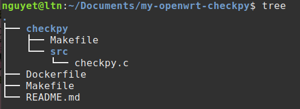

# Python 3.9 Version Checker for OpenWRT (Docker Simulation)

## Overview 

This project is designed to create a simple C program that:
- Executes a system command 
- Prints the Python version to the terminal
- Reports an error if Python 3.9 is not found.
- All of this is developed and tested in a Docker container that simulates an embedded Linux/OpenWRT-like environment.

---

##  Key Features

- C application that checks and logs Python 3.9 version
- Uses Docker to simulate an embedded development environment
- Proper Git branching and release tagging
- Includes a Makefile to build, run, clean, and (optionally) package
- Ready for future `.ipk` packaging for OpenWRT deployment

---

## Implementation
### 1. Project structure
<p align="center">
  
</p>

    This follows the standard OpenWRT package format, and it's required when you want to build a proper .ipk package using the OpenWRT SDK or build system.
        1. checkpy/Makefile
        This is not the same as your project-level Makefile. It defines the package metadata, build instructions, and installation path. OpenWRT's build system looks for this file to include and build your app as an .ipk.
        2. checkpy/src/checkpy.c
        This is your C code lives. When building the package, OpenWRT expects a src/ directory or similar structure for sources.
        3. Top-level Makefile
        This automates running Docker commands, compiling, or packaging from your local environment. It’s optional, but useful for scripting and development.

### 2. Package
    In OpenWRT, a package is a modular software component (like an app, utility, driver, or library) that can be installed, updated, or removed from the OpenWRT system using its package manager (opkg).

    What Is an OpenWRT Package?
    It's typically a .ipk file (similar to .deb in Debian or .rpm in Red Hat).
    It contains:
        - Compiled binary (executable)
        - Configuration files
        - Metadata (control file: name, version, dependencies...)
        - Scripts for install/remove actions

### 3. Docker
Docker is an open-source platform that allows developers to package applications and their dependencies into lightweight, portable containers. These containers can run consistently on any system that has Docker installed — whether it's a developer's laptop, a testing server, or a production cloud environment.

This is the Dockerfile:

```bash
# Uses Ubuntu 22.04 as the base image.
FROM ubuntu:22.04 

# Prevents interactive prompts during apt-get install
ENV DEBIAN_FRONTEND=noninteractive   

# Update and install packages: compilers, toolchain, utilities,..
RUN apt-get update && apt-get install -y \  
    build-essential clang flex bison g++ gawk \
    gcc-multilib g++-multilib gettext git subversion \
    libncurses5-dev libncursesw5-dev libssl-dev \
    python3-distutils python3-setuptools \
    rsync unzip zlib1g-dev file wget curl sudo \
    swig libpython3-dev time vim \
    && rm -rf /var/lib/apt/lists/*

# Creates a new user named builder with a home directory and Bash shell.
RUN useradd -ms /bin/bash builder && echo "builder ALL=(ALL) NOPASSWD:ALL" >> /etc/sudoers 
# Use the builder user from here
USER builder  
# Sets working directory to the OpenWRT source tree
WORKDIR /home/builder  

# Clones the official OpenWRT repository
RUN git clone https://github.com/openwrt/openwrt.git && \
    cd openwrt && \
    git checkout openwrt-23.05

WORKDIR /home/builder/openwrt

# Updates and installs feeds (external packages & libraries used in OpenWRT builds)
RUN ./scripts/feeds update -a && ./scripts/feeds install -a  

# Launches an interactive Bash shell when the container starts
CMD ["/bin/bash"]
```
### 4. Build and run
- From the project folder, run this command to build image from the current folder
```bash
docker build -t openwrt-builder .
```
- This command run the container in interactive terminal mode. Mount your local checkpy folder into the container’s OpenWRT build system under package/checkpy (this is where OpenWRT expects package definitions). Names the container openwrt-dev, so you can easily reference or reuse it later:
``` bash
docker run -it \
  -v $(pwd)/checkpy:/home/builder/openwrt/package/checkpy \  
  --name openwrt-dev \
  openwrt-builder 
```
- After that, you sucessfully go into the bash of container openwrt-dev with user name `builder@`. Then run this command:
``` bash
cd /home/builder/openwrt
make menuconfig
```
- In target system: choose <*>Broadcom BCM27xx
- In subtarget: choose <*>BCM2711 broads (64 bit)
- In target profile: choose <*>Raspberry Pi 4B/400/CM4 (64 bit)
- In uilities: choose <*>checkpy
```bash
make package/checkpy/compile V=s
```
- We use this command to build only your package (checkpy), nothing else in OpenWRT, it is faster and safe. It enables verbose logging (great for debugging compilation issues).
- After all these steps are done, the file `checkpy_1.0-1_aarch64_cortex-a72.ipk` is created. To check this file, run:
```bash
find /home/builder/openwrt -name "checkpy_*.ipk"
```
The result of this command will be: ```/home/builder/openwrt/bin/packages/aarch64_cortex-a72/base/checkpy_10-1_aarch64_cortex-a72.ipk```

### 5. Makefile:
    The Makefile placed outside the checkpy directory serves as a developer automation tool. It is not part of the OpenWRT build system, but rather a convenience for the developer to compile, run, test, or package the application more easily during development. 
    - This Makefile typically includes targets like make, make run, make clean, or make package, which can trigger commands such as compiling the C code, launching the Docker container, or creating a .ipk package manually. 
    - By using this file, the developer avoids having to type long or repetitive commands every time. 
    - In contrast, the Makefile inside the checkpy/ directory is specifically formatted for OpenWRT and used by the OpenWRT SDK to build the package properly.
This is the Makefile:
```bash
CONTAINER_NAME=openwrt-dev
# Image Docker
IMAGE=openwrt-builder:latest
PROJECT_DIR=$(HOME)/Documents/my-openwrt-checkpy/openwrt
DOCKER=docker
.PHONY: build run stop rm logs shell
# Build docker image
build:
	$(DOCKER) build -t $(IMAGE) .
# Create and run container
run:
	$(DOCKER) run -it --name $(CONTAINER_NAME) \
		-v $(PROJECT_DIR):/home/builder/openwrt/package/checkpy \
		--hostname=openwrt-builder \
		--network=host \
		--restart unless-stopped \
		$(IMAGE) \
		/bin/bash
# Start container ( stop before )
start:
	$(DOCKER) start -ai $(CONTAINER_NAME)
# Stop container
stop:
	$(DOCKER) stop $(CONTAINER_NAME)
# Delete container
rm:
	$(DOCKER) rm $(CONTAINER_NAME)
# Log container
logs:
	$(DOCKER) logs $(CONTAINER_NAME)
```
From that, when run container, stop, delete, log we just have to run this command:
```bash
make start
make stop
make rm
make logs
```

### 6. Git
Git is a version control system — a tool that helps you track changes in your code, collaborate with others, and manage different versions of your software projects.

Run this command:
```bash
# Initialize a new Git repository in the current directory
git init
# Create and switch to a new branch named feature/python-version-check
git checkout -b feature/python-version-check
# Stage all files in the current directory (recursively) to be included in the next commit
git add .
# Create a commit with a message describing the changes
git commit -m "Initial Python 3.9 check app"
# Create a Git tag (named v1.0-python-check) pointing to the current commit
git tag v1.0-python-check
# ush the current branch to the remote repo named origin
git push origin feature/python-version-check
```

### 7. Instruction and testing 
To test the package in Pi 4, we do these following steps:
1. Copy file `.ipk` from container to host
```bash
docker cp openwrt-dev:/home/builder/openwrt/bin/packages/aarch64_cortex-a72/base/checkpy_1.0-1_aarch64_cortex-a72.ipk ~/
```
2. Try to connect Pi 4 with laptop by LAN and SSH to Pi 4:
```bash
ssh root@192.168.1.1
```
3. From host's terminal, copy file `.ipk` from host to Pi 4:
```bash
scp checkpy_1.0-1_aarch64_cortex-a72.ipk root@192.168.1.1:/temp/
```
4. If Openwrt in Pi 4 has opkg, just run the file .ipk. If Pi 4 does not have opkg, you have to unzip file .ipk from host to get file execution and copy it to Pi 4. In host's termianl:
```bash
mkdir ~/checkpy_extract
cd ~/checkpy_extract
cp ~/checkpy_1.0-1_aarch64_cortex-a72.ipk .
mv checkpy_1.0-1_aarch64_cortex-a72.ipk checkpy.gz
gunzip checkpy.gz
tar -xvf checkpy
mkdir data && tar -xvf data.tar.gz -C data
cd data
scp ./usr/bin/checkpy root@192.168.1.1:/tmp/checkpy_bin
```
5. Then, SSH to Pi 4 and run:
```bash
/tmp/checkpy_bin
```

### 8. Conclusion
    This project successfully created a checkpy package to verify the presence of Python 3.9 on OpenWRT. The utility was written in C, integrated into the OpenWRT build system, packaged as a .ipk file, and tested on a Raspberry Pi 4.

    Besides placing the package in the package/ directory, the project also explored integrating it via a local Git-based feed. Docker was used to ensure a clean and reproducible build environment.

    The project provides a solid foundation for packaging custom applications for OpenWRT and can be extended for more advanced utilities in the future.
